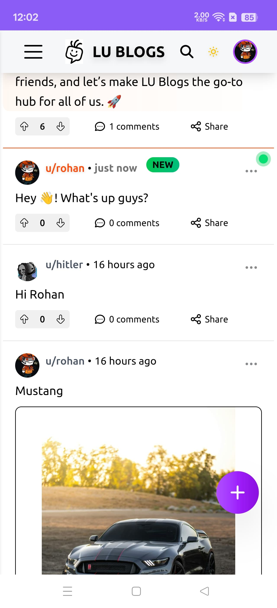
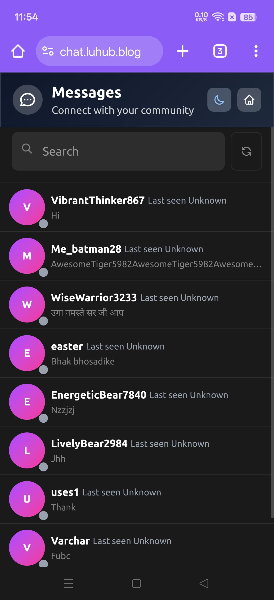
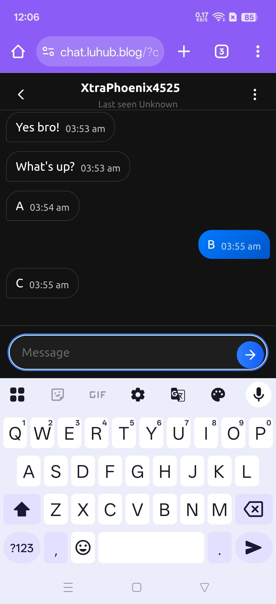
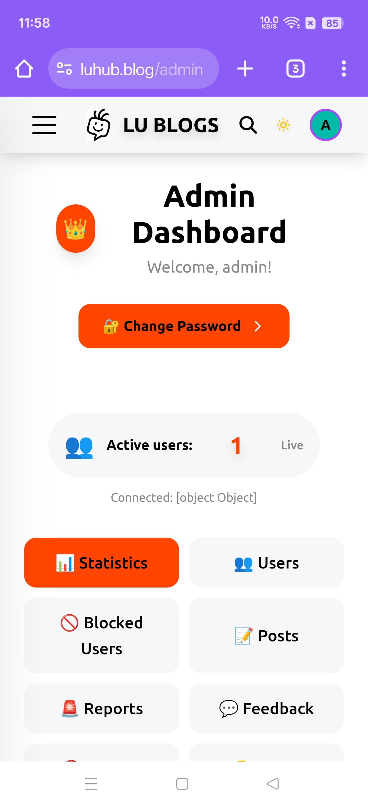
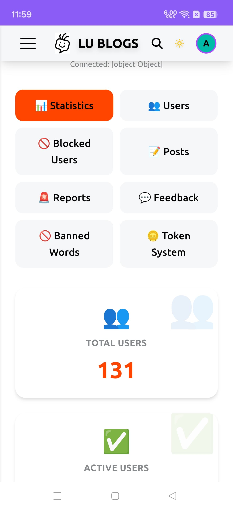
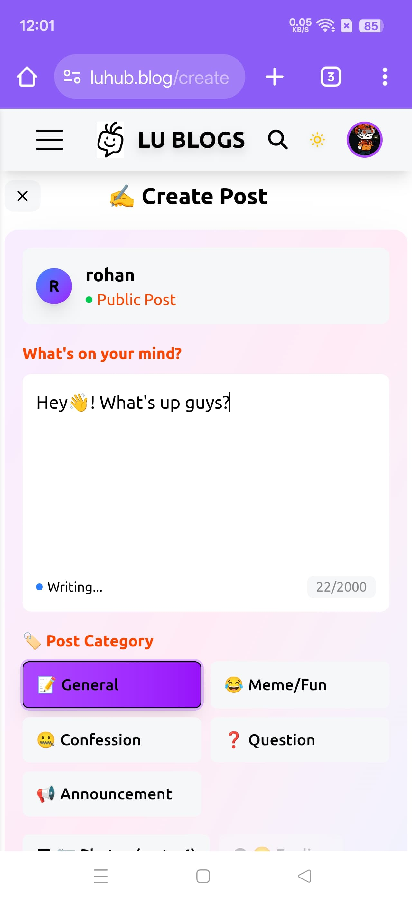
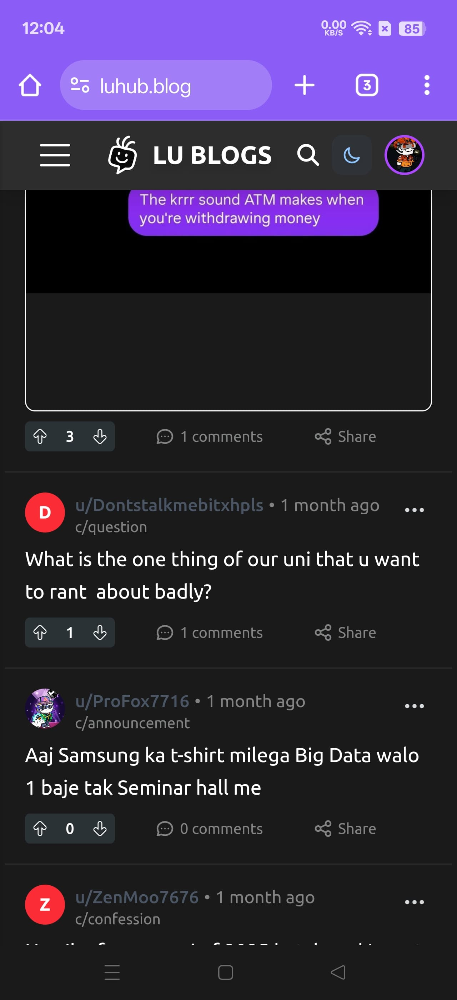
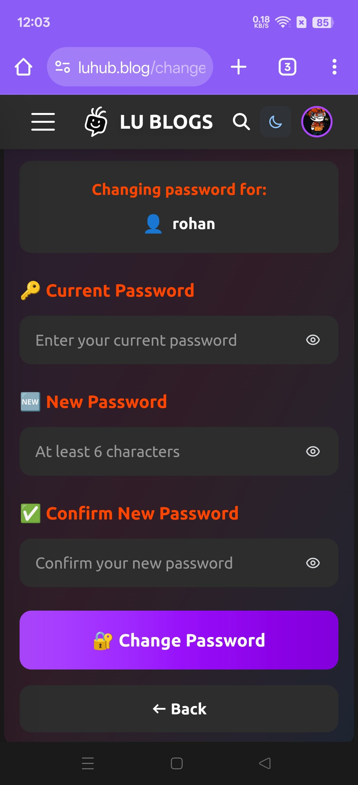
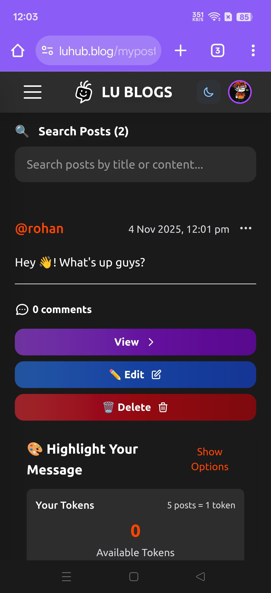
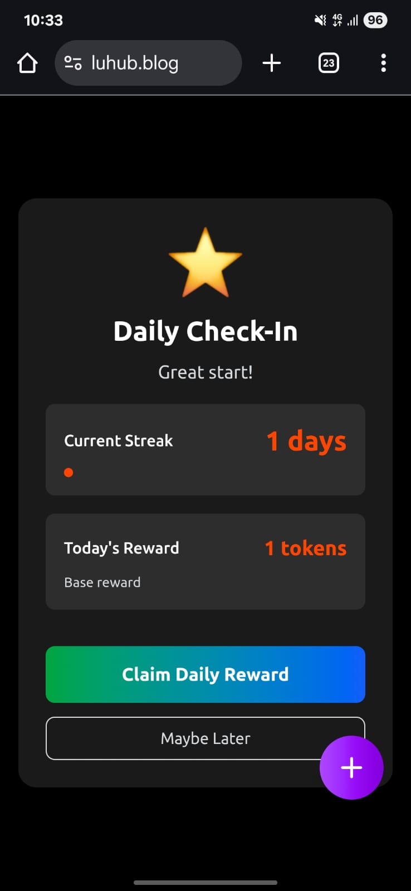

# LU BLOGS - University Community Platform

## Website Link
(https://luhub.blog)


## Demo Video
https://drive.google.com/file/d/1HvYVWqN5SXDvLhl6AydTwMlsW8sCAaF_/view?usp=drivesdk


## 📸 Screenshots

### Homepage - Trending Posts

*Main feed showing trending posts with Reddit-style voting and categories*

### Private Messaging



*Real-time private messaging with typing indicators and online status*

### Admin Dashboard


*Comprehensive admin panel with analytics and user management*

### Post Creation

*Rich post creation interface with image upload and category selection*

### Mobile View

*Fully responsive mobile interface optimized for touch interactions*

### Dark Mode

*Beautiful dark theme with glassmorphism effects*

### Password Change


### My Posts

*It allows to edit and delete post.

### Reward Page

*User can see their reward token on this page and can use to highlight their message.


**A modern, full-stack social blogging platform inspired by Reddit, built for university students to connect, share, and engage.**

---

## 📖 Project Overview

**LU BLOGS** is a comprehensive social blogging platform designed specifically for university communities. Think of it as a Reddit-style platform where students can share posts, engage in discussions, vote on content, and interact in real-time. The platform features a sophisticated ranking algorithm, private messaging, admin tools, and a reward system to encourage active participation.

### Why This Project?

This project demonstrates my ability to build a production-ready, full-stack web application with:
- **Complex algorithms** (Reddit-style hot score ranking)
- **Real-time features** (live chat, notifications, typing indicators)
- **Scalable architecture** (optimized database queries, connection pooling)
- **Security best practices** (rate limiting, authentication, input validation)
- **Modern UI/UX** (responsive design, dark mode, smooth animations)

---

## ✨ Key Features

### 🎯 Core Functionality

#### **Post Management**
- Create, edit, and delete posts with rich text content
- Support for multiple images per post
- Category-based organization (General, Meme/Fun, Confession, Question, Announcement)
- Search functionality by content or username
- Post reporting system with severity levels

#### **Reddit-Style Voting & Ranking**
- Upvote/Downvote system for posts and comments
- **Reddit Hot Score Algorithm** - Uses logarithmic scaling and time decay to rank trending content
- Wilson Score Interval for statistical confidence in voting
- Controversy score for balanced discussions
- Real-time score updates via WebSocket

#### **Comments System**
- Threaded comments with voting
- Comment editing and deletion
- Real-time comment updates

#### **Private Messaging**
- Real-time one-on-one messaging
- Typing indicators
- Online/offline status tracking
- Message history and conversation management
- Mobile-optimized chat interface

#### **User Engagement Features**
- **Token Reward System** - Earn tokens for daily check-ins, posts, and comments
- **Daily Check-In** - Gamification to encourage daily visits
- **Trending Posts** - Algorithmically ranked content based on engagement
- **User Profiles** - Customizable avatars (snoovatars) and profiles
- **Activity Dashboard** - Track user engagement and statistics

### 🔐 Authentication & Security

- Session-based authentication with JWT tokens
- Secure password hashing with bcrypt
- Password recovery with security questions
- Admin password reset functionality
- Rate limiting to prevent abuse (500 req/15min)
- Input validation and sanitization
- CORS protection
- Security headers with Helmet.js

### 👨‍💼 Admin Dashboard

- **User Management** - View, search, and manage users
- **Post Moderation** - Delete, edit, or moderate posts
- **Analytics Dashboard** - Real-time statistics and metrics
- **Advertisement Management** - Create and manage ads with analytics
- **Banned Words System** - Content filtering and moderation
- **Token Administration** - Manage reward system settings
- **Report Management** - Handle user reports with severity levels
- **Debug Tools** - Connection monitoring and system health

### 🎨 User Experience

- **Dark/Light Theme** - System preference detection with manual toggle
- **Responsive Design** - Fully optimized for mobile, tablet, and desktop
- **Real-time Updates** - Live user count, notifications, and activity
- **Push Notifications** - Browser notifications for comments, mentions, and messages
- **Image Optimization** - Automatic compression and lazy loading
- **Smooth Animations** - Glassmorphism effects and transitions
- **Accessibility** - Keyboard navigation and screen reader support

### 📊 Advanced Features

- **Real-time Analytics** - Track user activity, post performance, and engagement
- **Advertisement System** - Monetization with ad placement and click tracking
- **Feedback System** - User feedback collection with images
- **SEO Optimization** - Meta tags, structured data, and social sharing
- **Auto-reload Detection** - Smart page refresh notifications
- **Connection Monitoring** - Health checks and performance metrics

---

## 🛠️ Technology Stack

### Frontend
- **React 19** - Modern UI framework with hooks
- **Vite** - Lightning-fast build tool and dev server
- **Tailwind CSS v4** - Utility-first CSS framework
- **React Router v6** - Client-side routing
- **Socket.IO Client** - Real-time bidirectional communication
- **Axios** - HTTP client for API calls
- **Lottie React** - Smooth animations
- **Font Awesome** - Icon library

### Backend
- **Node.js** - JavaScript runtime
- **Express.js** - Web application framework
- **Socket.IO** - Real-time WebSocket server
- **Supabase (PostgreSQL)** - Database and storage
- **JWT** - Token-based authentication
- **Bcrypt** - Password hashing
- **Multer** - File upload handling
- **Web Push** - Push notification service

### Infrastructure & DevOps
- **Vercel** - Frontend hosting and deployment
- **Render** - Backend hosting and deployment
- **Supabase** - Database, authentication, and storage
- **Git** - Version control

### Security & Performance
- **Helmet.js** - Security headers
- **Express Rate Limit** - DDoS protection
- **CORS** - Cross-origin resource sharing
- **Compression** - Response compression
- **Connection Pooling** - Database optimization
- **Query Optimization** - Efficient database queries

---


> **Note**: To add screenshots, create a `screenshots/` folder in your project root and add your images there. Then update the paths above. See the "Adding Screenshots" section below.

---

## 🚀 Getting Started

### Prerequisites

- Node.js (v18 or higher)
- npm or yarn package manager
- Git
- Supabase account (for database and storage)

### Installation

1. **Clone the repository**
   ```bash
   git clone <repository-url>
   cd blog-page4-backup/backup7
   ```

2. **Set up the backend**
   ```bash
   cd server
   npm install
   cp env.example .env
   # Edit .env with your Supabase credentials
   npm run dev
   ```

3. **Set up the frontend**
   ```bash
   cd ../blog-page3
   npm install
   cp env.example .env.local
   # Edit .env.local with your backend URL
   npm run dev
   ```

4. **Access the application**
   - Frontend: http://localhost:5173
   - Backend API: http://localhost:3000

---

## 🌐 Live Demo

**Visit the live application**: [https://luhub.blog](https://luhub.blog)

### Test Credentials
- **Regular User**: Create an account to explore all features
- **Admin Access**: Contact me for admin demo credentials

---

## 📊 Architecture & Design Decisions

### Database Design
- **PostgreSQL** (Supabase) for relational data with JSONB for flexible schemas
- Optimized indexes on frequently queried fields (hot_score, created_at)
- Connection pooling for efficient resource management
- Row-level security policies for data protection

### Real-time Communication
- **Socket.IO** for bidirectional communication
- Room-based messaging for private conversations
- Connection deduplication to prevent memory leaks
- Throttling mechanisms to prevent abuse

### Ranking Algorithm
- **Reddit Hot Score Formula**: `log10(score) + (seconds - epoch) / 45000`
- Logarithmic scaling prevents score inflation
- Time decay ensures recent content stays relevant
- Wilson Score for statistical confidence

### Performance Optimizations
- Batch database queries to reduce round trips
- Pagination for large datasets
- Image compression and lazy loading
- Code splitting and tree shaking
- CDN for static assets

---

## 🔒 Security Features

- **Rate Limiting**: 500 requests per 15 minutes per IP
- **Authentication**: JWT tokens with secure session management
- **Input Validation**: Server-side validation for all user inputs
- **SQL Injection Prevention**: Parameterized queries
- **XSS Protection**: Content sanitization
- **CSRF Protection**: SameSite cookie attributes
- **Password Security**: Bcrypt with salt rounds
- **File Upload Security**: Type and size validation

---

## 📈 Performance Metrics

- **Page Load Time**: < 2 seconds
- **Time to Interactive**: < 3 seconds
- **API Response Time**: < 200ms average
- **WebSocket Latency**: < 50ms
- **Database Query Time**: < 100ms average

---

## 🎯 What I Learned

### Technical Skills
- Built a complex ranking algorithm from scratch
- Implemented real-time features with WebSocket
- Optimized database queries for performance
- Designed scalable architecture for growth
- Implemented security best practices

### Problem Solving
- Solved connection pooling issues in production
- Optimized real-time messaging for 500+ concurrent users
- Implemented efficient caching strategies
- Resolved memory leak issues in Socket.IO connections

### Full-Stack Development
- Coordinated frontend and backend development
- Managed deployment across multiple platforms
- Implemented CI/CD practices
- Handled production debugging and monitoring

---

## 🚧 Future Enhancements

- [ ] Email notifications
- [ ] Advanced search with filters
- [ ] Post scheduling
- [ ] User following system
- [ ] Community moderation tools
- [ ] Advanced analytics dashboard
- [ ] Mobile app (React Native)
- [ ] Multi-language support

---

## 👨‍💻 Developer

**Faijan Ahamed**

- **Portfolio**: [https://portfoliofaijan.vercel.app]
- **LinkedIn**: [www.linkedin.com/in/faijanahamed]
- **Email**: [faijanahamed11@gmail.com]
- **GitHub**: [https://github.com/faijanahamed11]

---